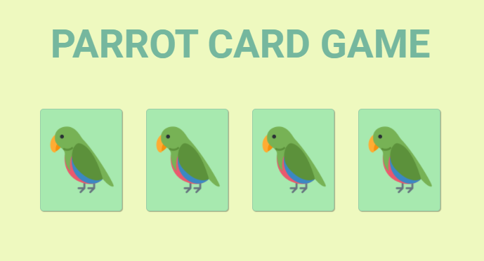

# Parrots Card Game

Project with JavaScript to implement Parrots Card Game, a themed memory game with randomness, effects and transition, responsiveness and dancing parrots!
## Project preview

## Deploy

Website available at: https://neves-gabriel.github.io/Projeto_04_parrotsCardGame/
## Author

👤 **Gabriel Neves**

- LinkedIn: [@GabrielNeves](https://www.linkedin.com/in/gabriel-rodrigues-neves/)
- Github: [@neves-gabriel](https://github.com/neves-gabriel)
## Stack

**Front-end:**   
